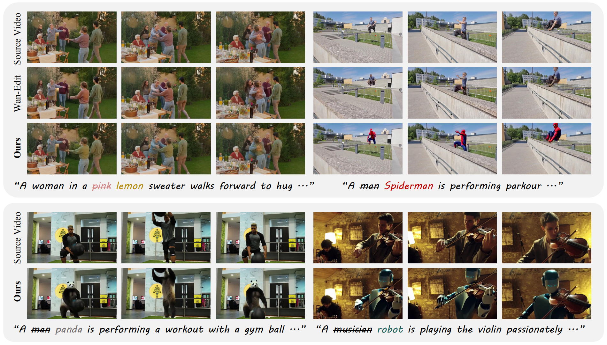

# FlowAnchor: Stabilizing the Editing Signal for Inversion-Free Video Editing


## 👀 Preview



**FlowAnchor stabilizes inversion-free video editing across diverse challenging scenarios.**  
While the inversion-free baseline Wan-Edit often struggles with mislocalized or weak edits, especially in multi-object scenes, fast-motion videos, and large semantic changes, **FlowAnchor** achieves precise localized editing with improved temporal consistency, semantic faithfulness, and background preservation.

## ✨ Overview

We propose **FlowAnchor**, a training-free framework for stable and efficient inversion-free, flow-based video editing.

Recent inversion-free editing methods have shown promising efficiency and structure preservation by directly steering the sampling trajectory with an editing signal. However, extending this paradigm from images to videos remains challenging, as the editing signal can become unstable in high-dimensional video latent spaces.

FlowAnchor addresses this problem by explicitly anchoring both:

- **where to edit**, through spatial-aware refinement of the editing guidance;
- **how strongly to edit**, through adaptive modulation of the editing magnitude.

With these two designs, FlowAnchor enables more faithful, temporally coherent, and efficient video editing, especially in challenging multi-object, fast-motion, and large semantic editing scenarios.

## 📰 News

- The paper is currently under review.


## 📖 Citation

If you find this work useful, please consider citing our paper.

```bibtex
@article{chen2026flowanchor,
  title={FlowAnchor: Stabilizing the Editing Signal for Inversion-Free Video Editing},
  author={Chen, Ze and Chen, Lan and Li, Yuanhang and Mao, Qi},
  journal={arXiv preprint arXiv:2604.22586},
  year={2026}
}

